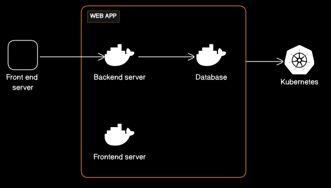

# Scaling Your Web Application with Docker and Kubernetes

In today's fast-paced digital landscape, the ability to efficiently scale web applications is crucial for ensuring optimal performance and handling increased traffic. Docker and Kubernetes have emerged as powerful tools for managing containerized applications and orchestrating their deployment at scale.

 <!-- Insert an image URL showing the architecture diagram here -->


## 1. What is Docker and Kubernetes?

### Docker

Docker is a containerization platform that allows you to package your application, along with its dependencies, into a single unit called a container. Containers are lightweight and portable, making it easy to deploy and manage applications consistently across different environments.

### Kubernetes

Kubernetes, often abbreviated as K8s, is an open-source container orchestration platform that automates the deployment, scaling, and management of containerized applications. It helps ensure that your application runs smoothly across a cluster of machines, provides self-healing capabilities, and simplifies the management of complex, distributed systems.

## 2. Benefits of Using Docker and Kubernetes for Scaling

Scaling your web application with Docker and Kubernetes offers numerous advantages:

- **Isolation:** Containers ensure that your application and its dependencies run consistently, preventing conflicts and reducing system-related issues.
- **Efficiency:** Kubernetes allows you to automate the scaling process, allocating resources as needed and reducing the manual effort required.
- **High Availability:** Kubernetes provides built-in mechanisms for redundancy, fault tolerance, and self-healing, ensuring your application is always available.
- **Resource Optimization:** You can efficiently use your infrastructure resources, scaling your application up or down based on demand.

## 3. Setting Up Your Environment

Before you dive into scaling your web application, you need to set up your development and production environments. This includes installing Docker and Kubernetes tools, configuring your cluster, and ensuring that your development environment mirrors the production setup.

Make sure you have Docker and Kubernetes installed and configured on your local machine or on your chosen cloud provider.

## 4. Containerizing Your Web Application with Docker

With your environment ready, it's time to containerize your web application. This involves creating a Docker image that packages your application code, its dependencies, and runtime environment into a single container. This ensures consistent execution across different environments.

```dockerfile
# Sample Dockerfile
FROM nginx:latest
COPY /path/to/your/webapp /usr/share/nginx/html
```

Build the Docker image and test it locally. Once you are satisfied with the containerized application, you are ready to move on to Kubernetes.

## 5. Deploying Containers to Kubernetes

Kubernetes uses YAML manifests to define and manage application deployments. You will need to create several YAML files to describe your application, such as Deployments, Services, and ConfigMaps. Here's a basic example of a Deployment YAML:

```yaml
apiVersion: apps/v1
kind: Deployment
metadata:
  name: webapp-deployment
spec:
  replicas: 3
  selector:
    matchLabels:
      app: webapp
  template:
    metadata:
      labels:
        app: webapp
    spec:
      containers:
        - name: webapp
          image: your-webapp-image:latest
```

## 6. Scaling Your Web Application

One of the key benefits of Kubernetes is its ability to scale applications seamlessly. You can manually adjust the number of application instances, or Kubernetes can autoscale based on CPU or memory usage. For manual scaling, you can use the kubectl command:

```bash
kubectl scale deployment webapp-deployment --replicas=5
```

This command scales the deployment to 5 replicas. For auto-scaling, you can set up Horizontal Pod Autoscalers (HPAs) to automatically adjust the number of pods based on your defined metrics.

## 7. Monitoring and Auto-scaling

To ensure that your web application scales effectively, you need to monitor its performance and set up auto-scaling rules. Kubernetes provides various tools and integrations for this purpose, such as Prometheus and Grafana for monitoring and Horizontal Pod Autoscalers (HPAs) for auto-scaling.

Monitoring tools will help you gather data on resource usage, while HPAs allow Kubernetes to automatically adjust the number of pods in your deployment based on predefined thresholds.

## 8. Ensuring High Availability

High availability is a crucial aspect of scaling web applications. Kubernetes inherently supports high availability by distributing containers across nodes in your cluster. This ensures that if a node fails, your application continues to run on other nodes.

Additionally, you can set up load balancers and use Kubernetes Ingress controllers to route traffic to your application, improving its resilience.

## 9. Security Considerations

When scaling your web application with Docker and Kubernetes, it's vital to consider security. Implement best practices for container security, regularly update your containers and underlying systems, and ensure that only authorized personnel have access to your cluster.

## 10. Conclusion

Scaling your web application with Docker and Kubernetes provides the scalability, efficiency, and high availability required in today's dynamic digital landscape. By containerizing your application and leveraging Kubernetes for orchestration, you can ensure that your web app can seamlessly handle increased traffic while maintaining a consistent and reliable performance.

Image Source <!-- Insert a URL for your image source if necessary -->

Now, you're ready to embark on your journey to scale your web application efficiently with Docker and Kubernetes. Happy scaling!
