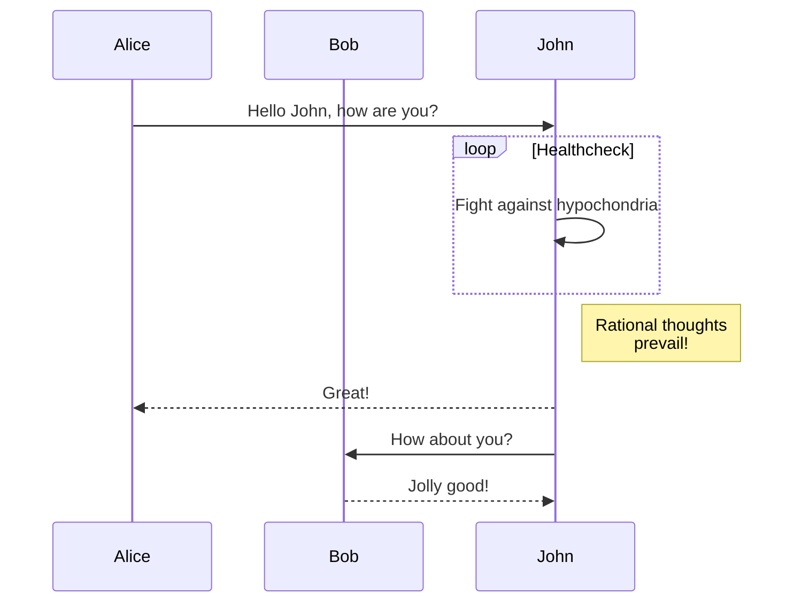

## Basics of Markdown
Markdown is the most popular markup language that can be used to format documents. It can be used to create *websites*,*ebooks*,*email*,*chats in discussions forums*.

### Topics
1. Paragraphs 

    MD expects a full line space to show texts in a different line else it joins text in the same line.
2.  Text decorations

    MD can write **bold** texts, ~~italiic~~ *italic*  texts
3. Headings
    No of #'s represent the type of heading. Github will automatically add id's to headings, so the text will be automatically linked. 
    ## This is h2
    ### This is h3

# My cool diagrams


    Also can show code difference


    ```diff
    var x = 10;
    - const counter = 0;
    + let counter = 0
    ```


8. Tables 

    Tables can be generated with headings and text alignment option

    |Stocks|Price|
    |:-----:|------:|
    |TCS|230|
    |YES Bank|500|

Some Text. [^footnote]


Cool Tips 

 * [Grammarly](https://marketplace.visualstudio.com/items?itemName=znck.grammarly) extension can eliminate typo and grammar mistakes
 * [ScreenTOGif](https://www.screentogif.com/) to record videos in GIF format
 * Upload GIF's to [giphy](https://giphy.com/) to embed them into blog posts.
 * [Stackedit](https://stackedit.io/) for Markdown Editing in Browser.

[^footnote]: This is a footnote.